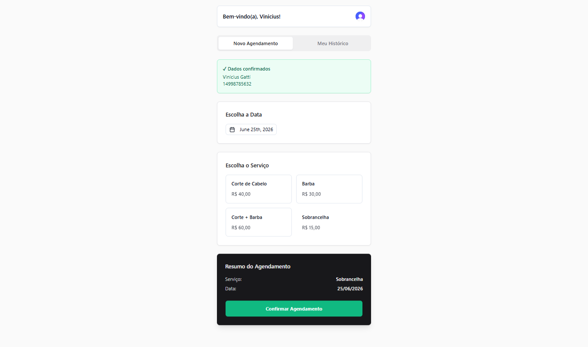
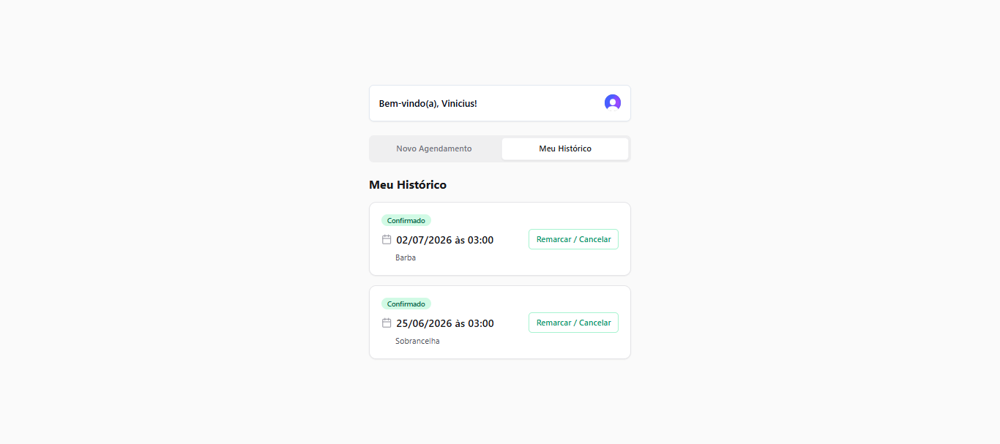
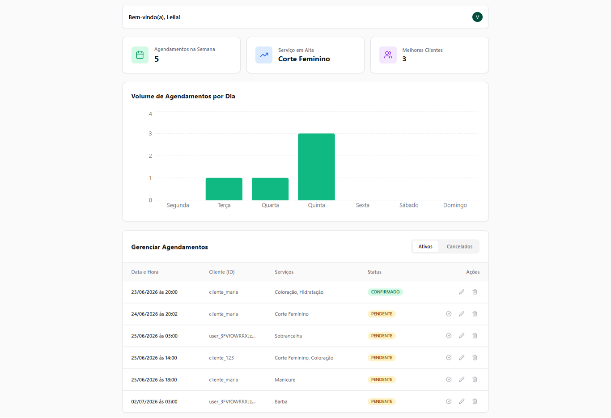
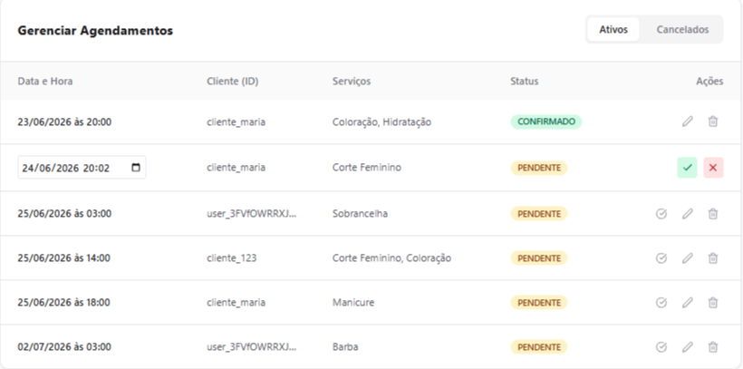

# Sistema de Agendamento - Salão da Leila

Este projeto é uma solução fullstack para o gerenciamento de agendamentos online do salão de beleza da Leila, permitindo que clientes marquem mais de um serviço, visualizem históricos e que a Leila tenha uma melhor otimização de sua agenda.

--- 

## Stack Tecnológica

- **Backend:** Python (FastAPI)
- **Frontend:** React + Vite + TypeScript
- **Autenticação:** Clerk Auth (JWT integrado no Backend via RBAC)
- **Banco de Dados:** SQLite (com SQLAlchemy ORM)
- **Gráficos e UI:** Recharts & Lucide React + Tailwind CSS
- **Arquitetura:** Domain-Driven Design (DDD) + Clean Architecture

---

## Arquitetura do Sistema (DDD)

O backend foi estruturado seguindo os princípios do DDD e do SOLID (Inversão de Dependência), garantindo isolamento total das regras de negócio:

- **Domain Layer:** Lógica central. Contém as Entidades de negócio (com Máquina de Estados), Objetos de Valor, Interfaces de Contrato (`IAgendamentoRepository`) e **Exceções Customizadas** do domínio. Padronizado com datas cientes de fuso horário (UTC).
- **Application Layer:** Orquestração de casos de uso e fluxos do sistema. Totalmente agnóstico a banco de dados, dependendo apenas de interfaces de repositório.
- **Infrastructure Layer:** Implementações técnicas e persistência. Implementação de repositórios reais (SQLAlchemy com mapeamento de JSON), adaptadores de banco de dados (SQLite) e decodificação de tokens do Clerk.
- **Presentation Layer (API):** Interface com usuário e entrada de dados. Componentes como Controladores FastAPI que expõem os endpoints REST.

---

## Estrutura do Banco de Dados (SQL)

A aplicação utiliza o **SQLAlchemy (ORM)** para gerenciar o banco de dados dinamicamente (Code-First), eliminando a necessidade de execução manual de scripts. O SQLite cria o arquivo `database.db` automaticamente na primeira inicialização.

Contudo, para fins de documentação e replicação estrutural, abaixo encontra-se o código **Data Definition Language (DDL)** correspondente à tabela principal gerada pelo sistema:

```sql
-- Criação da tabela principal de Agendamentos
CREATE TABLE IF NOT EXISTS agendamentos (
    id VARCHAR(36) PRIMARY KEY,
    cliente_id VARCHAR(255) NOT NULL,
    data_hora_agendada DATETIME NOT NULL,
    servicos TEXT NOT NULL, /* Armazenado via SQLAlchemy como Array JSON serializado */
    status VARCHAR(50) DEFAULT 'PENDENTE' NOT NULL
);

-- Índices gerados para otimização de buscas do Dashboard e Histórico
CREATE INDEX IF NOT EXISTS idx_agendamentos_cliente_id ON agendamentos(cliente_id);
CREATE INDEX IF NOT EXISTS idx_agendamentos_data_hora ON agendamentos(data_hora_agendada);
```
*(Nota: Você também pode encontrar este script no arquivo `schema.sql` na raiz do repositório).*

---

## Como Executar o Projeto

Por motivos de segurança e boas práticas de desenvolvimento, **arquivos de configuração local, credenciais de autenticação e o banco de dados populado não são baixados do repositório remoto**. Eles devem ser configurados localmente seguindo as instruções abaixo.

---

### 1. Configuração do Backend (Python / FastAPI)

1. Navegue até a pasta do backend:
```bash
   cd backend
   ```

2. Crie e ative um ambiente virtual (venv):
```bash
   python -m venv venv
   # No Windows (PowerShell):
   .\venv\Scripts\Activate
   # No Linux/macOS:
   source venv/bin/activate
   ```

3. Instale as dependências listadas:
```bash
   pip install -r requirements.txt
   ```

4. **Configuração de Segurança (NÃO BAIXADO):** Crie um arquivo chamado `.env` na raiz da pasta do backend. Este arquivo conterá as chaves secretas do Clerk que realizam a validação criptográfica do JWT. Adicione as seguintes variáveis (substitua com suas credenciais do painel do Clerk):
```env
   CLERK_API_KEY=sua_chave_secreta_aqui
   CLERK_JWT_KEY=sua_chave_publica_jwt_aqui
   ```

5. Execute o servidor de desenvolvimento:
```bash
   uvicorn src.main:app --reload
   ```
   *O backend estará disponível em `http://127.0.0.1:8000`. A documentação interativa automatizada pode ser acessada em `http://127.0.0.1:8000/docs`.*

---

### 2. Configuração do Frontend (React + Vite)

1. Navegue até a pasta do frontend:
```bash
   cd frontend
   ```

2. Instale os pacotes de dependências do Node.js:
```bash
   npm install
   ```

3. **Configuração de Ambiente (NÃO BAIXADO):**
   Crie um arquivo chamado `.env.local` na raiz da pasta do frontend para apontar o cliente para as chaves do Clerk e para a URL do seu backend local. Adicione:
```env
   VITE_CLERK_PUBLISHABLE_KEY=sua_chave_publicavel_do_clerk_aqui
   VITE_API_URL=[http://127.0.0.1:8000](http://127.0.0.1:8000)
   ```

4. Execute a aplicação em modo de desenvolvimento:
```bash
   npm run dev
   ```
   *O frontend abrirá localmente, geralmente no endereço `http://localhost:5173`.*

---

## Estratégia de Testes

Foco em testes unitários automatizados com `pytest` na camada de **Domínio e Aplicação** para garantir a integridade das seguintes regras críticas:
- **Máquina de estados:** bloqueio de transições inválidas (ex: concluir um serviço cancelado).
- **Trava de segurança:** bloqueio para alteração de agendamentos com menos de 48h de antecedência.
- **Algoritmo de sugestão:** detecção de agrupamento na mesma semana e comportamento de bypass.
- **Validação de RBAC:** Bypass de restrições de tempo para o Perfil Admin (Leila).
- **Geração de Métricas:** Agregação de dados para os indicadores gerenciais.

Para rodar a suíte de testes unitários, execute o comando na pasta raiz do backend:
```bash
pytest
```

---

## Progresso do Desenvolvimento

**Backend (Core Domain, Application, Infra e API) - CONCLUÍDO**
- [x] Modelagem da Entidade `Agendamento` e Máquina de Estados com `Enum`.
- [x] Regra de Negócio: Trava de 48h (D-2) para alteração por clientes comuns.
- [x] Caso de Uso: Criação com interceptação inteligente (Sugestão de agrupamento na semana).
- [x] Caso de Uso: Alteração/Ações administrativas com Bypass de Segurança (RBAC) para Admin (Leila).
- [x] Caso de Uso: Dashboard Gerencial com extração de métricas semanais.
- [x] Padronização de datas globais para Timezone UTC e tratamento de Exceções Customizadas.
- [x] Configuração física do SQLite e SQLAlchemy estruturada sob o padrão *Repository Pattern*.
- [x] Endpoints REST (FastAPI) documentados via Swagger e protegidos com criptografia HTTP Bearer.
- [x] Cobertura de Testes Unitários automatizados via `pytest` com 100% de aprovação (Passed).

**Frontend (React)**
- [x] Setup do ambiente com Vite, React, Tailwind CSS e TypeScript.
- [x] Integração completa da camada de autenticação e identificação de perfil com Clerk Auth.
- [x] Criação do Fluxo do Cliente (Formulários reativos, DatePicker e seleção dinâmica de múltiplos serviços).
- [x] Implementação da tela "Meu Histórico" para o cliente, contendo alertas visuais baseados na regra das 48h.
- [x] Desenvolvimento do Dashboard Administrativo da Leila integrado a gráficos analíticos (`recharts`).
- [x] Tabela reativa de gestão com controle de Abas (Filtros de registros Ativos vs. Cancelados).
- [x] Implementação de Exclusão Lógica (*Soft Delete*) na base de dados com possibilidade de restauração imediata.
- [x] Criação do controle de status operacional (Fluxo de homologação de agendamentos de PENDENTE para CONFIRMADO).

---

## Imagens das Telas do Sistema

Abaixo estão os registros visuais que comprovam o funcionamento das interfaces e a segregação de permissões de acesso baseadas em papéis (RBAC).

### 1. Fluxo do Cliente - Agendamento Online
Interface limpa adaptada para a usabilidade em dispositivos mobile, guiando o cliente nas etapas de preenchimento de dados cadastrais, seleção do dia no calendário e inclusão de múltiplos serviços.


### 2. Fluxo do Cliente - Histórico e Regras de Negócio
Tela que lista todos os agendamentos já realizados por aquele usuário logado. Exibe o status em tempo real e dispara a trava visual de bloqueio caso falte menos de 48 horas para o procedimento, orientando o usuário a ligar para o salão.


### 3. Dashboard Gerencial da Administradora (Leila)
Painel exclusivo acessado apenas pelo perfil administrador. Contém os cartões com indicadores chave de desempenho (KPIs), como volume de agendamentos na semana, serviços em alta e gráficos de barra interativos demonstrando a distribuição da demanda diária.


### 4. Tabela de Gestão e Workflow de Status
Painel operacional da proprietária que permite a listagem centralizada da agenda, alteração forçada inline de datas (Bypass administrativo) e acionamento do fluxo de homologação, alterando o status do cliente de PENDENTE para CONFIRMADO.


### 5. Central de Lixeira e Restauração (Soft Delete)
Aba especializada que isola os agendamentos cancelados, impedindo-os de poluir as métricas financeiras do salão, mas permitindo que a Leila desfaça exclusões acidentais através do botão de restauração em um clique.
